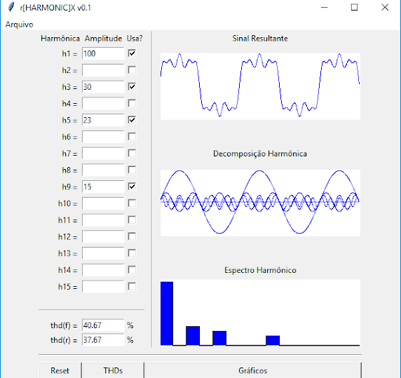

rHarmonic[X] - Harmonics Plotter
--------------------------------

This is a python3/tk software that plots harmonic sines waves.

Features:
- Plot of individual waves
- Plot of summed waves
- Bar Plot
- Up to 15 harmonics
- Automated scaling
- THDf and THDr 
- Brazillian Portuguese (pt_BR) interface 

Binaries:
- Binaries are provided for Windows 10 - 64bits 

Screenshot
----------

